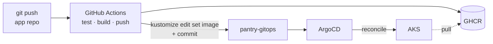
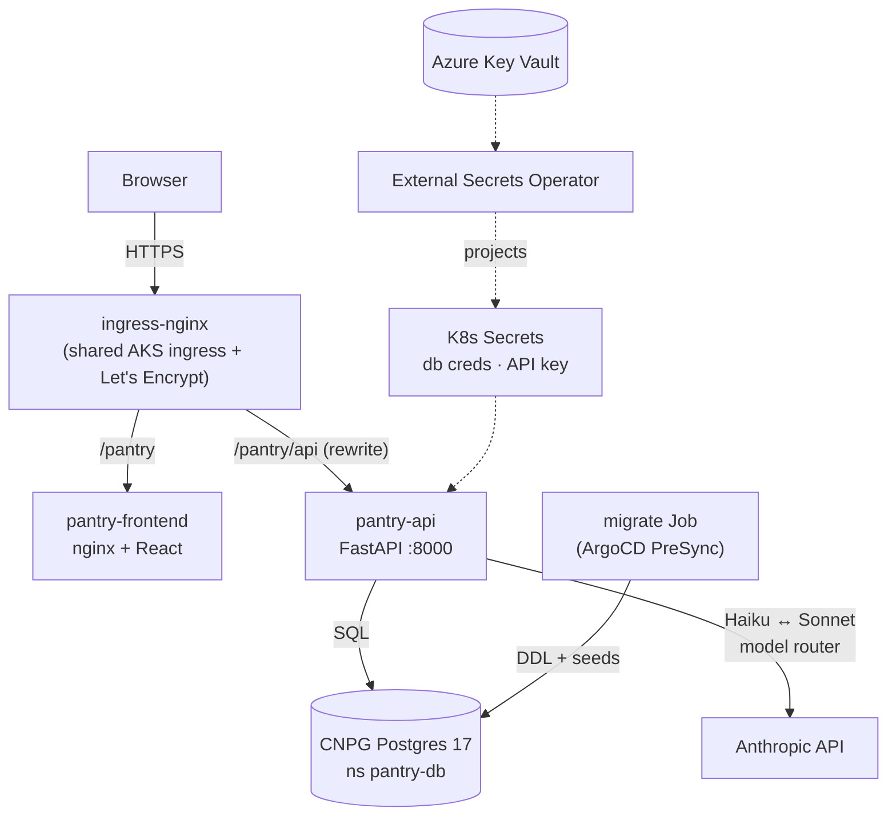

# 🥫 pantry-platform

A complete, small-scale **GitOps reference implementation**: a grocery-matching
app (recipes → best-value store picks) — React + FastAPI running a Claude-based
agentic workflow that **generates NL2SQL** to query a Postgres grocery database
for the most relevant data meeting natural-language search constraints, then
uses a **model router** to cost-effectively select the model based on the size
of the data and the evaluated complexity; on AKS via GitOps (GitHub Actions,
Argo CD), where **a git commit is the only deployment mechanism**.

This umbrella repo pins all five components as git submodules, carries the
architecture docs, and ships a one-command local run.

**Demo:** deployed to AKS via the full pipeline (see the verified run in
[pantry-gitops's commit history](https://github.com/pjvjay/pantry-gitops/commits/main) —
every `bump … to dev-<sha>` commit is CI deploying). The dev cluster runs
**on demand** to keep idle cost at zero; reproduce the whole stack locally in
one command (below).

## The repos

| Repo (submodule) | Layer | CI output |
|---|---|---|
| [pantry-frontend](https://github.com/pjvjay/pantry-frontend) | React + Vite SPA behind nginx | `ghcr.io/pjvjay/pantry-frontend` |
| [pantry-api](https://github.com/pjvjay/pantry-api) | FastAPI + Claude model-router pipeline (Burr state machine) | `ghcr.io/pjvjay/pantry-api` |
| [pantry-db](https://github.com/pjvjay/pantry-db) | Schema migrations + seeds, psql runner | `ghcr.io/pjvjay/pantry-db-migrate` |
| [pantry-gitops](https://github.com/pjvjay/pantry-gitops) | ArgoCD app-of-apps + Kustomize manifests | — (watched by ArgoCD) |
| [pantry-infra](https://github.com/pjvjay/pantry-infra) | Terraform bootstrap: Key Vault secret + ArgoCD root app | — |

## How a change ships



No `kubectl apply` from a laptop, no CI credentials against the cluster —
CI's only cluster-facing permission is **write access to one git repo**.
Rollback = `git revert`.

## Runtime architecture



## GitOps practices demonstrated

- **App-of-Apps** — one root Application fans out to an `AppProject` +
  child Applications; adding a service is a git commit, not an ArgoCD change
- **Scoped AppProject** — the demo can only deploy from its own repo into
  its own namespaces; Namespace is the only cluster-scoped kind allowed
- **Sync waves + PreSync hooks** — namespaces → secrets → database →
  migrations → workloads, ordered and enforced
- **Separation of concerns** — schema (pantry-db) ≠ app (pantry-api) ≠
  desired state (pantry-gitops) ≠ bootstrap (pantry-infra)
- **No secrets in git** — Key Vault → External Secrets Operator via Workload
  Identity; the gitops repo holds only references
- **Immutable, multi-arch images** — every deploy pins `dev-<sha>`; `latest`
  exists only for local pulls
- **Self-heal + prune** — manual cluster drift reverts automatically

## Run it locally

```bash
git clone --recurse-submodules https://github.com/pjvjay/pantry-platform
cd pantry-platform
export ANTHROPIC_API_KEY=sk-ant-...   # optional — browsing works without it
docker compose up --build
# → http://localhost:8080/pantry/
```

Same containers, same migration flow as the cluster — compose plays the role
of ArgoCD + ingress.

## Deploy it

```bash
cd pantry-infra
terraform apply        # seeds Key Vault + the ArgoCD root Application
```

Everything else converges from git. Details in
[pantry-infra](https://github.com/pjvjay/pantry-infra) and
[pantry-gitops](https://github.com/pjvjay/pantry-gitops).

## Working with the submodules

Submodule pins mark a **known-good set** across the five repos — a
platform-level release marker.

```bash
git submodule update --remote --merge   # pull every repo to latest main
git commit -am "pin: <what changed>"    # record the new known-good set
```

## Origin

The app itself (the Claude model-router pipeline) predates the platform —
it was a standalone interview artifact. This umbrella wraps it in the same
GitOps architecture as the production
[a prior project](https://an-internal-repo) polyrepo, scaled down
to be readable in an afternoon.
